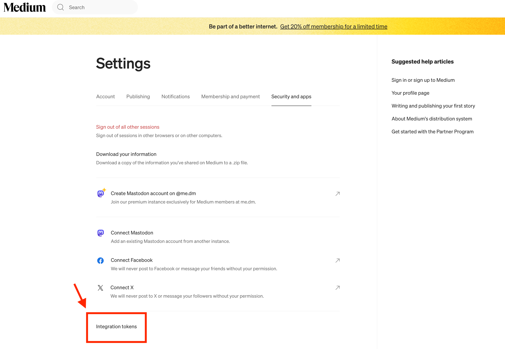

# Publishing posts to Medium and Hashnode via API

To build off of the previous post where I built a blog-agent to generate blog outlines and posts, I wanted to extend the functionality to publish the posts to Medium and Hashnode. This post will cover the process of publishing posts to Medium and Hashnode via their respective APIs.

## Medium

Assuming you already have a Medium account, you can get API access by going to your profile settings -> Security and Apps ->  Integration Tokens. See the below image for reference.



Once you have the integration token, you can use it to authenticate your requests to the Medium API. The API documentation can be found [here](https://github.com/Medium/medium-api-docs).

To understand the Medium API, I will direct you to the docs linked above, but for now, we will be using the following API endpoints:

* GET https://api.medium.com/v1/me - Get my authenticated user ID
* POST https://api.medium.com/v1/users/{{authorId}}/posts - Create a post
* GET https://api.medium.com/v1/users/{{userId}}/publications - Get a list of publications for a user

## Medium API Client

First, I had to set up an `HttpClientService` class that would handle the GET and POST calls to the Medium API (and future 3rd party API calls for that matter). It looked like this:
```java
 @Service
public class HttpClientService {

    private final HttpClient httpClient;
    private final ObjectMapper objectMapper;

    public HttpClientService(ObjectMapper objectMapper) {
        this.httpClient = HttpClient.newHttpClient();
        this.objectMapper = objectMapper;
    }

    public String get(String url, Map<String, String> headers) throws IOException, InterruptedException {
        HttpRequest.Builder requestBuilder = HttpRequest.newBuilder()
                .uri(URI.create(url))
                .GET();

        headers.forEach(requestBuilder::header);

        HttpRequest request = requestBuilder.build();

        HttpResponse<String> response = httpClient.send(request, HttpResponse.BodyHandlers.ofString());
        return response.body();
    }

    public String post(String url, Object requestBody, Map<String, String> headers) throws IOException, InterruptedException {
        String jsonBody = objectMapper.writeValueAsString(requestBody);

        HttpRequest.Builder requestBuilder = HttpRequest.newBuilder()
                .uri(URI.create(url))
                .POST(HttpRequest.BodyPublishers.ofString(jsonBody));

        headers.forEach(requestBuilder::header);

        HttpRequest request = requestBuilder.build();

        HttpResponse<String> response = httpClient.send(request, HttpResponse.BodyHandlers.ofString());
        return response.body();
    }
}
```

This class is a simple wrapper around Java's `HttpClient` class and will allow me to build future API clients with ease. The `get` and `post` methods take in a URL, request body, and headers, and return the response body as a string.

Next, I created a `MediumApiMgr` class that would handle the Medium API calls. Looking at the necessary API calls above, I created the following methods:

1. `getMediumUser` - Get the authenticated Medium User:
```java
    public MediumUserResponse getMediumUser() {
        String url = API_BASE_URL + "/me";
        Map<String, String> headers = new HashMap<>();
        headers.put("Authorization", "Bearer " + accessToken);
        headers.put("Accept", "application/json");

        try {
            String apiResponse = httpClientService.get(url, headers);
            MediumUserResponse user = MediumApiHelper.parseMediumApiResponse(apiResponse, MediumUserResponse.class);
            return user;
        } catch (IOException | InterruptedException e) {
            throw new RuntimeException(e);
        }
    }
```
2. `createPost` - Create a post:
```java
    public MediumPostResponse createPost(String authorId, MediumPostRequest postRequest) {
        String url = API_BASE_URL + "/users/" + authorId + "/posts";

        Map<String, String> headers = new HashMap<>();
        headers.put("Authorization", "Bearer " + accessToken);
        headers.put("Content-Type", "application/json");
        headers.put("Accept", "application/json");

        try {
            String apiResponse = httpClientService.post(url, postRequest, headers);
            MediumPostResponse post = MediumApiHelper.parseMediumApiResponse(apiResponse, MediumPostResponse.class);
            return post;
        } catch (IOException | InterruptedException e) {
            throw new RuntimeException(e);
        }
    }
```


